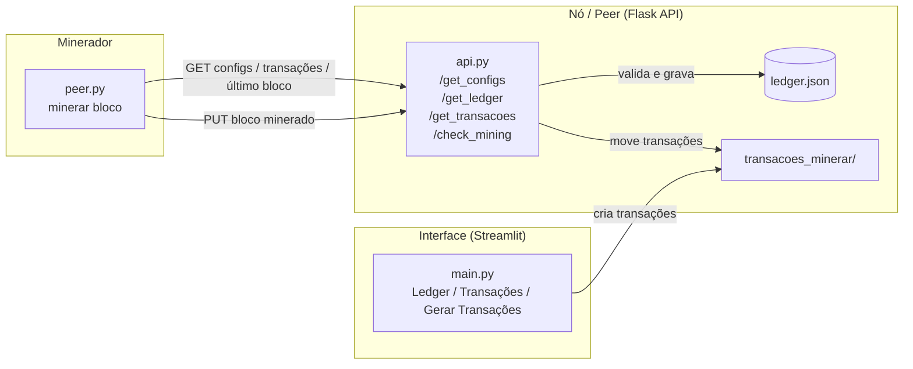

# Protocolo Bitcoin — Blockchain Didática em Python

Implementação educacional (do zero) do protocolo do Bitcoin em Python. O projeto reproduz, de forma didática, os principais mecanismos de uma blockchain: **construção de blocos**, **mineração via Proof of Work**, **algoritmo SHA-256 implementado manualmente**, **árvore de Merkle**, **validação de blocos** e uma **rede peer-to-peer simplificada** com API e mineradores externos.

> Objetivo: entender, na prática, como o Bitcoin funciona por baixo dos panos — sem depender de bibliotecas de hashing prontas. Até o SHA-256 é implementado manualmente.

---

## Índice

- [Visão geral da arquitetura](#visão-geral-da-arquitetura)
- [Estrutura de pastas](#estrutura-de-pastas)
- [Como funciona](#como-funciona)
  - [1. Bloco e header](#1-bloco-e-header)
  - [2. Árvore de Merkle](#2-árvore-de-merkle)
  - [3. SHA-256 (duplo, estilo Bitcoin)](#3-sha-256-duplo-estilo-bitcoin)
  - [4. Mineração (Proof of Work)](#4-mineração-proof-of-work)
  - [5. Validação do bloco](#5-validação-do-bloco)
  - [6. Rede peer-to-peer](#6-rede-peer-to-peer)
- [Instalação](#instalação)
- [Como executar](#como-executar)
- [Configuração](#configuração)
- [Formato do Ledger](#formato-do-ledger)
- [Tecnologias](#tecnologias)
- [Aviso](#aviso)

---

## Visão geral da arquitetura

O sistema é dividido em três papéis principais:



1. **Interface (Streamlit)** — visualiza o ledger e cria novas transações no pool.
2. **Nó / API (Flask)** — fornece as configurações, o ledger e as transações em aberto; recebe blocos minerados, valida-os e os grava no ledger.
3. **Minerador (peer)** — busca as transações pendentes no nó, minera o bloco (Proof of Work) e envia o resultado de volta para validação.

---

## Estrutura de pastas

```
protocolo_bitcoin/
├── main.py                     # App Streamlit (menu: Ledger / Transações / Gerar Transações)
├── api.py                      # API Flask do nó (endpoints da rede)
├── peer.py                     # Minerador: busca transações, minera e envia o bloco
├── requirements.txt            # Dependências Python
│
├── *.bat                       # Atalhos Windows para iniciar cada componente
│   ├── start_api.bat           # Inicia a API (python api.py)
│   ├── minerar.bat             # Inicia o minerador (python peer.py)
│   ├── abrir_ledger.bat        # Abre a interface Streamlit (main.py)
│   └── gerar_transacoes.bat    # Abre a interface de geração de transações
│
├── configs/
│   └── configuracoes.json      # versão, dificuldade, target e recompensa
│
├── ledger/
│   └── ledger.json             # A blockchain (lista encadeada de blocos)
│
├── models/
│   ├── sha_256.py              # SHA-256 padrão (mensagem completa)
│   ├── sha_bitcoin.py          # SHA-256 do Bitcoin (com hash anterior encadeado)
│   └── minerar.py              # Loop de mineração / Proof of Work
│
├── utils/
│   ├── constants.py            # Primos, letras, paddings do SHA-256
│   ├── operations.py           # Operações bit a bit (AND, XOR, rotações, soma mod 2^32)
│   ├── merkle.py               # Construção da árvore e raiz de Merkle
│   ├── shasha.py               # Duplo SHA-256 aplicado ao header
│   ├── utils.py                # Validação de bloco, escrita no ledger, pool de transações
│   └── fechar_transacoes.py    # Fecha o pool de transações para mineração
│
├── pgs/                        # Páginas da interface Streamlit
│   ├── pg_ledger.py            # Visualização dos blocos do ledger
│   ├── pg_transacoes.py        # Visualização das transações
│   └── pg_gerar_transacoes.py  # Formulário para criar novas transações
│
├── transacoes_minerar/         # Pool: transações aguardando mineração
└── transacoes_mineradas/       # Histórico de transações já mineradas
```

---

## Como funciona

### 1. Bloco e header

Cada bloco possui um **header** (cabeçalho) construído a partir da concatenação em binário dos seguintes campos, na mesma ordem do Bitcoin real:

| Campo                  | Tamanho | Descrição                                       |
| ---------------------- | ------- | ----------------------------------------------- |
| `versao`               | 32 bits | Versão do protocolo do bloco                    |
| `hash_bloco_anterior`  | 256 bits| Hash do bloco anterior (encadeamento)           |
| `hash_raiz_merkle`     | 256 bits| Raiz da árvore de Merkle das transações         |
| `timestamp`            | 32 bits | Momento da mineração (Unix time)                |
| `target`               | 32 bits | Alvo de dificuldade                             |
| `nonce`                | 32 bits | Número variável ajustado durante a mineração    |

O header é completado com *padding* para atingir os blocos de 512 bits exigidos pelo SHA-256.

### 2. Árvore de Merkle

Em [utils/merkle.py](utils/merkle.py), as transações são reduzidas a um único hash (a **raiz de Merkle**):

1. Cada transação é individualmente convertida em hash (SHA-256).
2. Os hashes são agrupados em **pares** e concatenados; se houver número ímpar, o último é duplicado.
3. Cada par gera um novo hash, formando o próximo nível da árvore.
4. Repete-se até restar **um único hash** — a raiz de Merkle.

Isso permite verificar a integridade de todas as transações a partir de um único valor no header.

### 3. SHA-256 (duplo, estilo Bitcoin)

O projeto implementa o SHA-256 **do zero**, sem usar `hashlib`:

- [utils/operations.py](utils/operations.py) — operações fundamentais: AND, OR, NOT, XOR, deslocamentos, rotações à direita e soma módulo $2^{32}$.
- [utils/constants.py](utils/constants.py) — as constantes derivadas das raízes cúbicas dos primeiros 64 números primos e os paddings.
- [models/sha_bitcoin.py](models/sha_bitcoin.py) — a compressão SHA-256 com suporte a **hash encadeado** (permite processar o header em duas partes, como no Bitcoin).
- [utils/shasha.py](utils/shasha.py) — aplica o **duplo SHA-256** (`SHA256(SHA256(header))`), característica marcante do Bitcoin.

### 4. Mineração (Proof of Work)

Em [models/minerar.py](models/minerar.py), o minerador procura um `nonce` que produza um hash final válido:

$$\text{hash}(\text{header}) \Rightarrow \text{começa com } N \text{ zeros e } < \text{target}$$

- Itera o `nonce` de $0$ até $2^{32}-1$.
- Recalcula o duplo SHA-256 do header a cada tentativa.
- Um hash é **válido** quando:
  - possui `dificuldade` zeros à esquerda, **e**
  - um trecho específico do hash é numericamente menor que o `target`.
- Exibe o **hash rate** (H/s) em tempo real.
- Se esgotar todos os nonces, incrementa `voltas_nonce` (altera a raiz de Merkle) e recomeça.

A **recompensa** de mineração é adicionada como uma transação especial (`de: "rede"`) para o minerador.

### 5. Validação do bloco

Quando um bloco minerado chega ao nó (`PUT /check_mining`), [utils/utils.py](utils/utils.py) executa três checagens (todas precisam passar):

1. **`checar_hash_final`** — recomputa o duplo SHA-256 do header e compara com o `hash_final` enviado.
2. **`checar_hash_merkle`** — recalcula a raiz de Merkle das transações e compara.
3. **`checar_transacoes`** — confirma que as transações correspondem às que estavam no pool.

Se válido, o bloco é gravado em [ledger/ledger.json](ledger/ledger.json) e as transações são movidas do pool para o histórico.

### 6. Rede peer-to-peer

A API Flask ([api.py](api.py)) expõe os endpoints do nó:

| Método | Endpoint          | Descrição                                              |
| ------ | ----------------- | ------------------------------------------------------ |
| `GET`  | `/get_configs`    | Retorna versão, dificuldade, target e recompensa       |
| `GET`  | `/get_ledger`     | Retorna a blockchain completa                          |
| `GET`  | `/get_transacoes` | Retorna as transações do pool aguardando mineração     |
| `PUT`  | `/check_mining`   | Recebe um bloco minerado, valida e grava no ledger     |

O minerador ([peer.py](peer.py)) conecta-se a um nó informando IP e porta, baixa o necessário, minera e devolve o bloco.

---

## Instalação

Requer **Python 3.11+**.

```powershell
# Crie e ative um ambiente virtual (opcional)
python -m venv venv_cbp
venv_cbp\Scripts\activate

# Instale as dependências
pip install -r requirements.txt
```

> Os arquivos `.bat` usam `conda activate cbp`. Ajuste-os para o seu ambiente (`venv` ou `conda`) conforme sua configuração.

---

## Como executar

Abra terminais separados para cada componente:

**1. Inicie o nó (API):**
```powershell
python api.py
```
A API sobe em `http://0.0.0.0:5000`.

**2. Abra a interface para criar/visualizar transações:**
```powershell
streamlit run main.py
```

**3. Minere um bloco:**
```powershell
python peer.py
```
Informe o IP e a porta do nó (padrão: IP local e `5000`).

Ou, no Windows, use os atalhos: `start_api.bat`, `abrir_ledger.bat`, `gerar_transacoes.bat` e `minerar.bat`.

---

## Configuração

Ajuste [configs/configuracoes.json](configs/configuracoes.json):

```json
[
    {
        "versao": 15453,
        "dificuldade": 4,
        "target": 4294967295,
        "recompensa": 25
    }
]
```

| Campo         | Descrição                                                                 |
| ------------- | ------------------------------------------------------------------------- |
| `versao`      | Versão do protocolo dos blocos                                            |
| `dificuldade` | Quantidade de zeros à esquerda exigidos no hash (↑ = mais difícil)        |
| `target`      | Alvo numérico de dificuldade                                             |
| `recompensa`  | Valor concedido ao minerador por bloco                                    |

> Aumentar a `dificuldade` torna a mineração exponencialmente mais lenta.

---

## Formato do Ledger

Cada bloco em [ledger/ledger.json](ledger/ledger.json) segue o formato:

```json
{
    "versao": 15452,
    "dificuldade": 3,
    "target": 4294967295,
    "nonce": 6264,
    "timestamp": 1730432356,
    "hash_bloco_anterior": "000ba9cb...",
    "hash_raiz_merkle": "48c8650d...",
    "transacoes": [
        { "de": "igor", "para": "vera", "valor": 100.0 },
        { "de": "rede", "para": "Book-Igor", "valor": 50.0 },
        { "voltas_nonce": 0 },
        { "minerador": "Book-Igor" }
    ],
    "hash_final": "000c2e31..."
}
```

O `hash_bloco_anterior` de cada bloco aponta para o `hash_final` do bloco anterior, formando a **cadeia** (chain) imutável.

---

## Tecnologias

- **Python 3.11+**
- **Flask** + **Flask-RESTful** — API do nó
- **Streamlit** — interface web
- **NumPy** — operações numéricas do SHA-256
- **Requests** — comunicação entre minerador e nó

---

## Aviso

Este é um projeto **didático**, destinado ao estudo dos fundamentos do Bitcoin e das blockchains. **Não** deve ser usado em produção nem como sistema financeiro real — não há criptografia de chaves, assinaturas digitais, consenso distribuído robusto ou segurança de rede adequados a um ambiente real.
